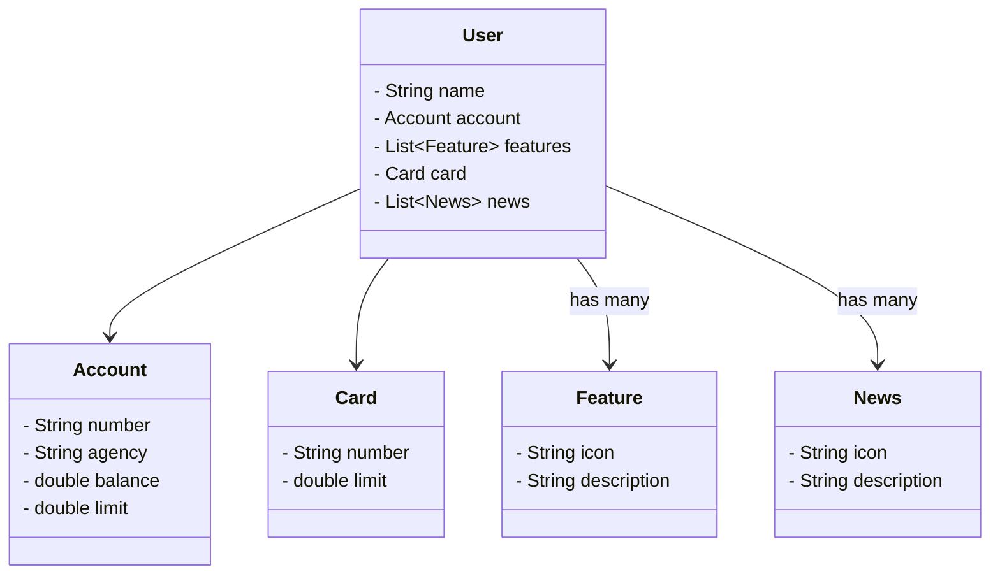

## Diagrama de Classes

```mermaid

classDiagram
    class User {
        - String name
        - Account account
        - List~Feature~ features
        - Card card
        - List~News~ news
    }

    class Account {
        - String number
        - String agency
        - double balance
        - double limit
    }

    class Feature {
        - String icon
        - String description
    }

    class Card {
        - String number
        - double limit
    }

    class News {
        - String icon
        - String description
    }

    User --> Account
    User --> Card
    User --> Feature : has many
    User --> News : has many

```

